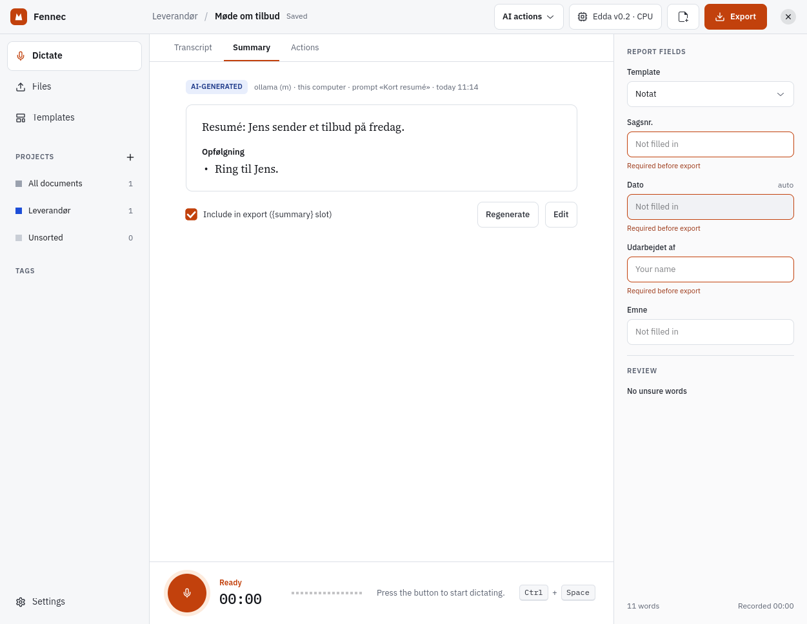
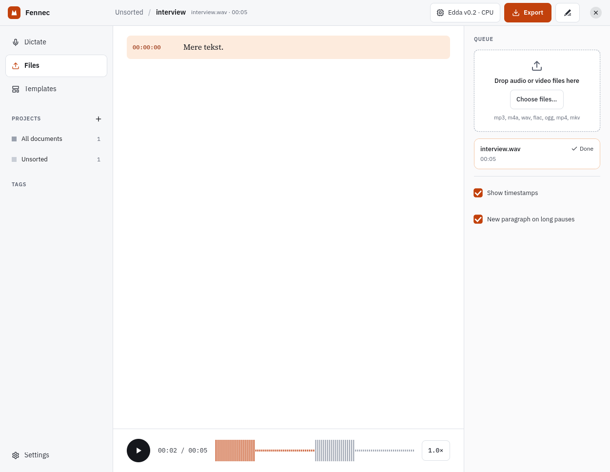
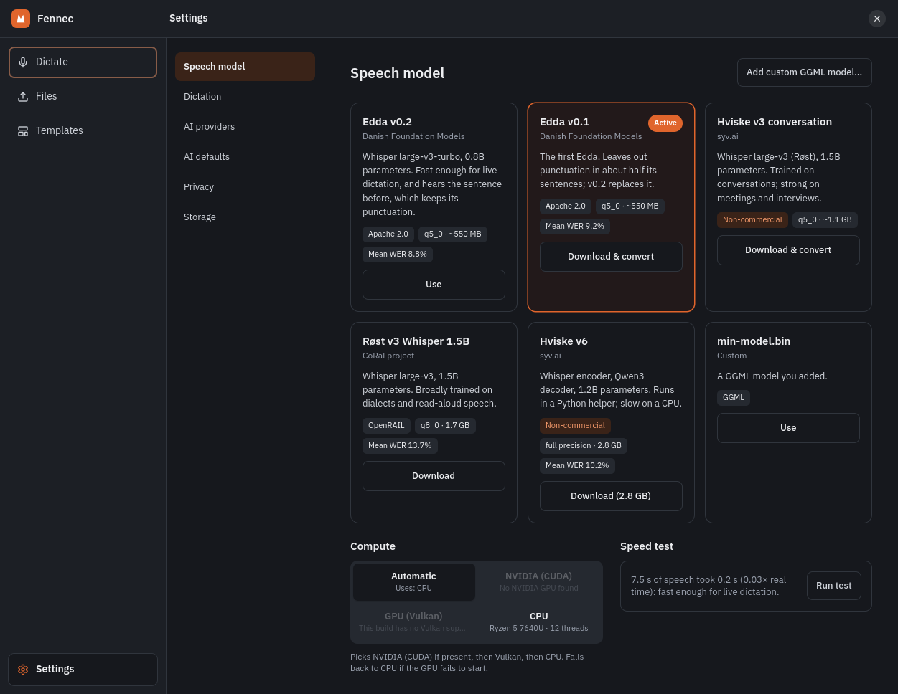
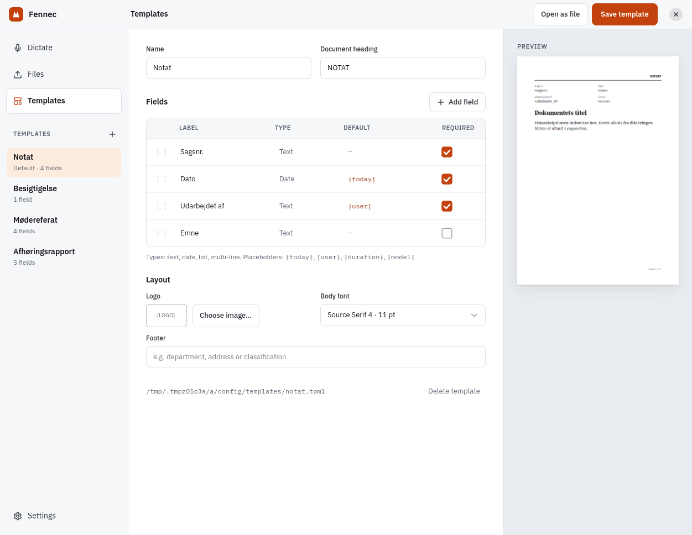
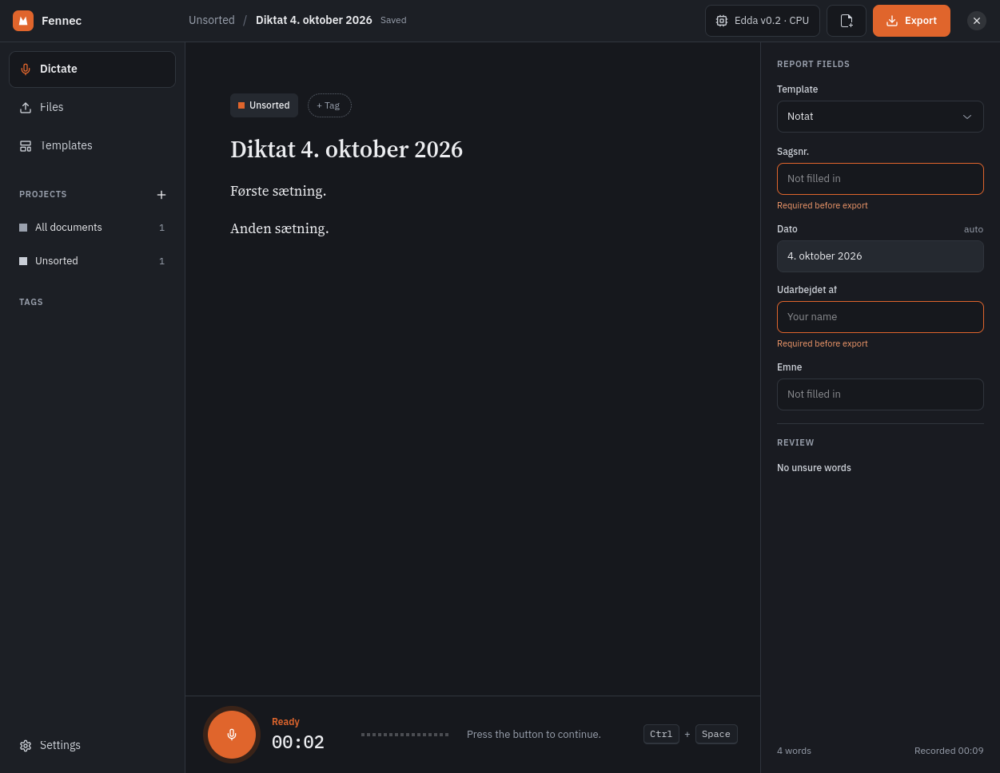
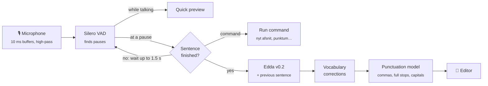

<div align="center">


# Fennec

**Danish dictation and transcription that runs entirely on your own computer.**

Speak, and the text appears with commas, full stops and capitals.<br>
No audio leaves the machine, and no account or internet connection is needed once the models are downloaded.

[](Cargo.toml)




</div>

---

## Why Fennec

Danish speech recognition has become very good, but most tools that use it send
your voice to a server. Fennec puts the best open Danish models behind a fast
native desktop app, so meeting notes, reports and interviews stay on your own
disk.

- 🎙️ **Live dictation**: text appears a moment after each pause, and a
  short preview shows while you are still talking.
- ✍️ **Real punctuation**: a Danish punctuation model adds commas, full stops
  and capitals. Sentence ends rose from F1 0.61 to 0.81, with no words
  changed.
- 🗣️ **Spoken commands**: *nyt afsnit*, *ny linje*, *punktum*, *komma*,
  *spørgsmålstegn*, *slet sidste sætning*, *stop optagelse* and more. You can
  add your own phrases.
- 📂 **File transcription**: audio or video in, timestamped paragraphs out,
  with a player to check every passage.
- 📚 **Learns your words**: a vocabulary list fixes names and terms the model
  mishears, and Fennec offers to remember a word whenever you correct it
  in the editor.
- 🧾 **Report templates and export**: header fields plus body, exported to
  TXT, DOCX or PDF, one document or a whole project at a time.
- 🗂️ **Projects and tags**: group documents, search across them and export
  them together.
- 🤖 **Optional AI** (off by default): summaries, clean-up shown as a diff,
  action items and questions answered from a project with sources. Works with
  Claude, ChatGPT, or a local model (Ollama, llama.cpp, LM Studio, vLLM).
- 📱 **Record on your phone**: Fennec Recorder for Android records meetings
  and sends the audio straight to Fennec over your own network, where it is
  transcribed like any file. See [`android/`](android/README.md).

The interface is in English; transcripts and AI answers are in Danish.

## Screenshots

<table>
  <tr>
    <td></td>
    <td></td>
  </tr>
  <tr>
    <td align="center"><sub>Transcribe audio and video files</sub></td>
    <td align="center"><sub>Pick and install speech models</sub></td>
  </tr>
  <tr>
    <td></td>
    <td></td>
  </tr>
  <tr>
    <td align="center"><sub>Report templates with a live preview</sub></td>
    <td align="center"><sub>Dictation, in the dark style</sub></td>
  </tr>
</table>

## Quick start

The easiest way in is the ready-made package from
[Releases](https://github.com/AngelFreak/Fennec/releases) (Ubuntu 24.04 or
newer). It uses the GPU through Vulkan when there is one, and the CPU
otherwise.

```sh
sudo apt install ./fennec_*.deb
```

To build it yourself, Fennec needs Linux with GTK 4.14+ and libadwaita 1.5+
(Ubuntu 24.04 or newer) and Rust 1.88+.

```sh
sudo apt install libgtk-4-dev libadwaita-1-dev libasound2-dev cmake clang
git clone https://github.com/AngelFreak/Fennec && cd Fennec

make install FEATURES=vulkan   # AMD / Intel / NVIDIA GPU (needs glslc and libvulkan-dev)
make install FEATURES=cuda     # NVIDIA via CUDA
make install                   # CPU only
```

`make install` puts Fennec in `~/.local` and needs no root. For a Debian
package, run `make deb FEATURES=vulkan` and then
`sudo apt install ./target/debian/fennec_*.deb`.

On first launch, a bar offers a **single download** of everything dictation
needs: the speech model, the voice detector and the punctuation model, about
1 GB together. Nothing else needs to be set up.

<details>
<summary>Optional extras and building without root</summary>

- `ffmpeg`, for video and audio formats Fennec cannot decode itself.
- GStreamer good plugins, for playback in Files.
- A Secret Service keyring (GNOME Keyring or KWallet), to store AI API keys.

Without root, `glslc` can be unpacked from Ubuntu's packages:
`apt-get download glslc libshaderc1`, `dpkg -x` each into a folder, then put
its `usr/bin` on `PATH` and its `usr/lib/x86_64-linux-gnu` on
`LD_LIBRARY_PATH`.

</details>

## Speed

Use a GPU build for live dictation. On a laptop with a Ryzen 5 7640U and its
integrated Radeon 760M:

| | Vulkan (760M) | CPU only |
|---|---|---|
| Edda, real-time factor | **0.19×** | 1.9× |
| Start dictating | ~0.4 s to the first audio | |
| Live dictation | ✅ keeps up | ❌ falls behind |

File transcription works on either. **Settings → Speech model** shows which
backends this build and computer can use, and **Run speed test** times a
Danish sentence on your machine. If the GPU fails to start, Fennec falls back
to the CPU.

## Speech models

| Model | Publisher | Licence | Size | WER |
|---|---|---|---|---|
| **Edda v0.2** (default) | Danish Foundation Models | Apache 2.0 | ~550 MB | 8.8 % |
| Edda v0.1 | Danish Foundation Models | Apache 2.0 | ~550 MB | 9.2 % |
| Hviske v3 conversation | syv.ai | OpenRAIL, non-commercial | ~1.1 GB | – |
| Røst v3 Whisper 1.5B | CoRal project | OpenRAIL | 1.7 GB | 13.7 % |
| Hviske v6 | syv.ai | CC BY-NC 4.0 | 2.8 GB | 10.2 % |

WER is the mean word error rate shown in Fennec's model list, based on the
[Danish ASR leaderboard](https://huggingface.co/spaces/RyeAI/danish-asr-leaderboard).
On held-out Danish FLEURS sentences here, Edda v0.2 scored 6.2 %.

**Edda v0.2** is a fine-tuned Whisper large-v3-turbo. It reads the previous
sentence as context, which keeps its punctuation consistent across pauses.
Fennec downloads a ready-converted GGML file
([`tec-7/edda-v0.2-ggml`](https://huggingface.co/tec-7/edda-v0.2-ggml)), so
installing it needs no Python.

You can also add any whisper.cpp GGML file with **Add custom GGML model…**.

<details>
<summary>Converting the other models</summary>

Røst v3 downloads as a ready-made GGML file. Hviske v3 is published only as a
Hugging Face checkpoint, so Fennec converts it, which needs:

- Python with `torch`, `transformers` and `huggingface_hub` (set
  `FENNEC_PYTHON` to use a virtualenv's Python).
- A [whisper.cpp](https://github.com/ggml-org/whisper.cpp) checkout (set
  `WHISPER_CPP`; the default is `~/dev/whisper.cpp`) with `whisper-quantize`
  built in `build-fennec/`.

Hviske v6 is not a Whisper model that whisper.cpp can run (it pairs a Whisper
encoder with a Qwen3 decoder). Fennec runs it in a small Python helper, which
needs `torch` and `transformers`. It is slower than the others on a CPU and
gives no word confidences.

</details>

## How dictation works



- **Sentences survive a pause.** At each pause a quick pass checks whether the
  sentence has ended. If it hasn't, Fennec waits a little longer so a thought
  isn't cut in half. In a test with pauses in the middle of sentences, this
  cut word errors from 13.9 % to 7.7 %.
- **Punctuation only adds.** The punctuation model (Alvenir's Danish BERT, run
  in Rust with [candle](https://github.com/huggingface/candle)) inserts marks
  and capitals but never changes or removes a word, so a spoken *komma* always
  stays.
- **The UI never waits on the model.** Speech runs on its own thread with
  priorities. The level meter runs on the display's frame clock, and the
  microphone opens in about 50 ms.

## Privacy

- Audio is processed on this computer and is never uploaded.
- Receiving from phones is off until you pair one in **Settings → Phone**.
  Recordings travel encrypted from the phone to this computer only; only
  phones you pair (and press Allow for) can send, and Remove shuts one out.
- AI stays off until you switch it on in **Settings → AI providers**, and
  nothing is sent until you start an action yourself.
- The first time a document or project goes to a **cloud** provider, Fennec
  asks and names the destination. Projects marked **Local only** never go to
  the cloud.
- API keys are stored in the desktop keyring, not in a settings file.
- Every AI result is labelled with the provider and model that wrote it, and
  clean-up never changes text until you accept it.

## Where things live

| What | Where |
|---|---|
| Settings | `~/.config/fennec/settings.toml` |
| Templates | `~/.config/fennec/templates/*.toml` |
| Documents (SQLite) | `~/.local/share/fennec/fennec.db` |
| Models | `~/.local/share/fennec/models/` |
| Dictation and phone audio | `~/.local/share/fennec/audio/` |
| Phone pairing certificate | `~/.local/share/fennec/sync/` |
| Exports | `~/Documents/Fennec/` |

## Development

```sh
cargo test                     # unit, integration and the GTK UI test
cargo clippy --all-targets
cargo fmt
```

- `tests/ui.rs` opens the real window and drives it with a scripted engine,
  synthetic audio and local mock AI servers, so it needs a display.
  `FENNEC_SCREENSHOT_DIR=dir cargo test --test ui` saves a screenshot of every
  screen.
- Engine tests use `tests/fixtures/models/`, filled by
  `python scripts/fetch_models.py tiny vad`.
- Tests that need the real models are `#[ignore]`d; run them with
  `cargo test -- --ignored` once the models are installed.
- `tests/phone_sync.rs` drives the phone receiver over real HTTPS;
  `android/e2e/run-e2e.sh` runs Fennec and Fennec Recorder (in the Android
  emulator) together. The app's own tests are in [`android/`](android/README.md).

`fennec-bench` compares models on the same audio, reporting WER and comma and
sentence-end F1:

```sh
python scripts/prepare_fleurs.py      # Danish FLEURS test split → manifest.tsv
fennec-bench --manifest ~/.cache/fennec/fleurs-da/manifest.tsv --limit 200 \
    ~/.local/share/fennec/models/edda-v0.2-q5_0.bin
```

The design, with its reasoning and measurements, is in
[`docs/plans/`](docs/plans/).

### Not yet verified

- Fennec Recorder is tested in the Android emulator, whose microphone gives
  silence and whose network carries no mDNS; recording real speech and
  finding Fennec again after its address changes have not been tried on a
  real phone yet. Camera scanning is tested by reading a screenshot of
  Fennec's code with the app's scanner, not through a camera.

- The AI actions are tested against mock servers that speak each API, but not
  yet with a real Claude or ChatGPT key.
- Hviske v6 is tested with a stand-in model; the real 2.8 GB model has not
  been run (`cargo test --test sidecar -- --ignored` once it is downloaded).

## Credits

- Speech recognition: [whisper.cpp](https://github.com/ggml-org/whisper.cpp)
  (MIT) through [whisper-rs](https://github.com/tazz4843/whisper-rs).
- [Edda](https://huggingface.co/danish-foundation-models) by Danish Foundation
  Models (Apache 2.0).
- Punctuation:
  [Alvenir/bert-punct-restoration-da](https://huggingface.co/Alvenir/bert-punct-restoration-da)
  (Apache 2.0), run with [candle](https://github.com/huggingface/candle).
- Voice detection: [Silero VAD](https://github.com/snakers4/silero-vad) (MIT).
- The speed-test clip and test fixture come from
  [FLEURS](https://huggingface.co/datasets/google/fleurs) (Google, CC BY 4.0).
- Document font: [Source Serif 4](https://github.com/adobe-fonts/source-serif)
  (SIL OFL 1.1).
- Every model belongs to its publisher under the licence listed above. The
  Hviske v3 and Hviske v6 licences do not allow commercial use.

## License

Fennec is released under the MIT licence.
